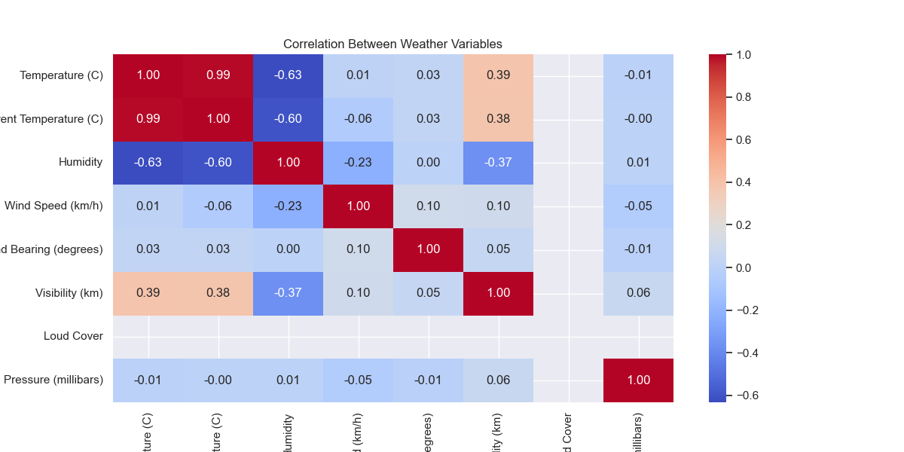
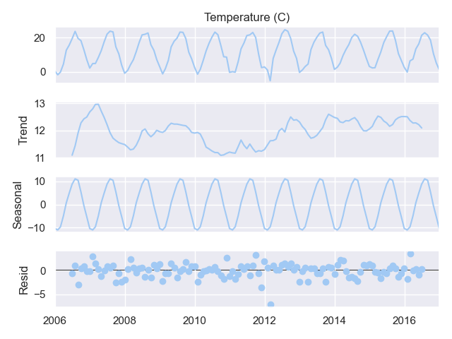
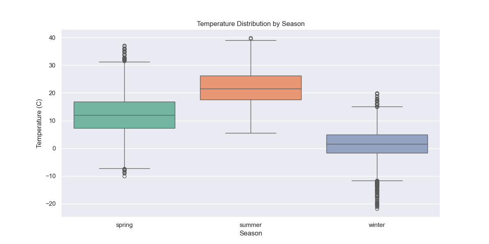

"# Weather-DATA-ANALYSIS" 

## **Day 1: Exploratory Data Analysis (EDA)**  
### **Objectives**  
1. Load and clean the dataset.  
2. Perform basic exploratory analysis.  
3. Create visualizations using **Seaborn**.  

---

### **Key Findings**  
1. **Temperature Distribution**:  
   - Most temperatures cluster between 10°C and 25°C.  
   - A slight bimodal distribution suggests seasonal patterns.  
     

2. **Temperature Over Time**:  
   - Clear seasonal trends with peaks in summer and troughs in winter.  
     

3. **Humidity vs. Rainfall**:  
   - Higher humidity correlates with increased rainfall.  
   - Warmer temperatures (color gradient) show less frequent rainfall.  
    

   ## **Day 2: Advanced Analysis**
### Key Findings
1. **Correlations**:
   - Humidity and rainfall are strongly correlated (+0.7).
   - Temperature and humidity show a negative correlation (-0.6).
2. **Seasonal Decomposition**:
   - Clear yearly seasonality with summer peaks.
   - No significant long-term trend observed.
3. **Hypothesis Testing**:
   - Summer temperatures are significantly hotter than winter (p < 0.001).

### Visualizations

